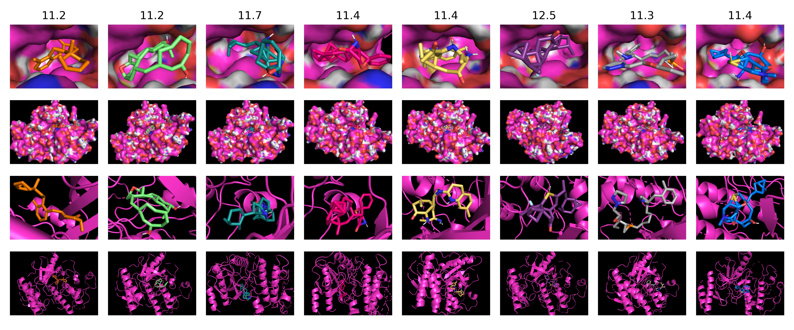
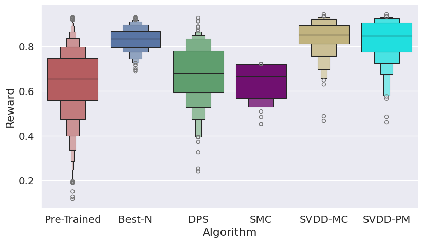
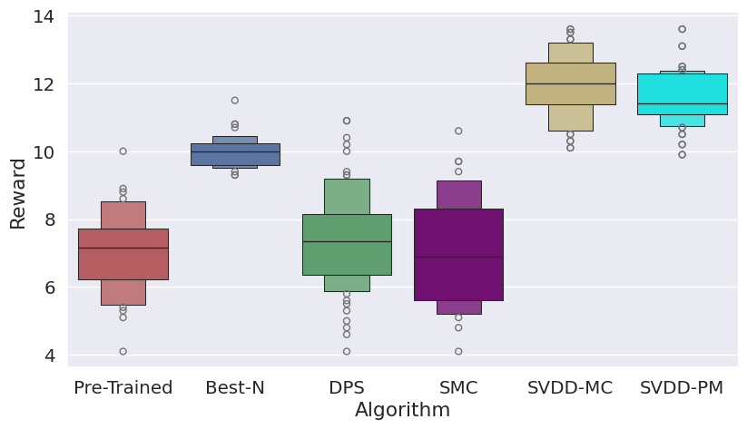

# Derivative-Free Guidance in Diffusion Models with Soft Value-Based Decoding (Molecules)

This code accompanies [the paper](https://arxiv.org/abs/2408.08252) on soft value-based decoding in diffusion models, where the objective is to maximize downstream reward functions in diffusion models. 

This repo is the implementation of molecule generation tasks. For biological sequences, such as **DNA (enhancers)** and **RNA (5'UTRs)**, refer to [here](https://github.com/masa-ue/SVDD). For **images**, refer to [here](https://github.com/masa-ue/SVDD-image).

Visualization examples of the ligand-protein docking task is shown below.

<figure>
  
  <figcaption>Visualization: docking with braf</figcaption>
</figure>

The algorithm is summarized in the following table/figure.  


 

## Prerequisites

Run the following commands to install the dependencies:

```sh
conda create -n svdd python=3.8
conda activate svdd
conda install -c pytorch pytorch==1.12.0 cudatoolkit=11.3
pip install rdkit==2023.9.1
pip install -U numpy=1.22.2
pip install scipy==1.8
pip install pandas==1.4.2 tqdm matplotlib==3.5.2 networkx==2.8.8 scikit-learn apricot-select
git clone https://github.com/molecularsets/moses.git
cd moses/
python setup.py install
pip install easydict pyemd wandb dill
conda install conda-forge::openbabel
```

## Decoding

To decode using SVDD-MC, run the following 

`CUDA_VISIBLE_DEVICES=5 python main.py --type decode_valueF --config sample_zinc250k --reward_name QED --sample_M 10`

The above command runs value-weighted decoding. The reward can be QED or SA or vina1/.../vina5. Hyperparameters can be adjusted in the config file.
If `load_checkpoint_path` in config file is `null`, it will run decoding using the oracle; otherwise using the value function checkpoint.

If we want to use the SVDD-PM way, run the following 

`CUDA_VISIBLE_DEVICES=7 python main_tw.py --type decode_valueF --config sample_zinc250k --reward_name vina3 --sample_M 10`

If we want to use the baseline method SMC, run the following

`CUDA_VISIBLE_DEVICES=7 python main_TDS.py --type decode_valueF --config sample_zinc250k --reward_name QED --sample_M 1 --alpha 0.3`

<figure>
  
  <figcaption>Histogram comparison: QED</figcaption>
</figure>

<figure>
  
  <figcaption>Histogram comparison: docking with parp1</figcaption>
</figure>

[//]: # (![QED]&#40;media/molecule_qed_distribution.png&#41; )

[//]: # ()
[//]: # (![Docking-parp1]&#40;media/molecule_vina1_distribution.png&#41; )

[//]: # ()
[//]: # (![Visualization]&#40;media/mol_vina5_plot_pymol_grid.jpg&#41; )

## Training

`CUDA_VISIBLE_DEVICES=7 python main.py --type decode_valueF_train --config sample_qm9 --reward_name QED`

The above command runs GIN value function training. The reward can be QED or SA. Training strategy/model hyperparameters can be adjusted in the config file.
The `load_checkpoint_path` in config file need to be `null` to train GIN from scratch.
Note that running this needs PyG packages installed.

```sh
pip install torch-scatter torch-sparse torch-cluster torch-geometric
```


## Pretrained generative model

We follow this paper [Score-based Generative Modeling of Graphs via the System of Stochastic Differential Equations](https://arxiv.org/abs/2202.02514) (ICML 2022).

They implement the *Graph Diffusion via the System of SDEs* (GDSS).


### Dependencies

GDSS is built in **Python 3.7.0** and **Pytorch 1.10.1**. Please use the following command to install the requirements:

```sh
pip install -r requirements.txt
```

For molecule generation, additionally run the following command:

```sh
conda install -c conda-forge rdkit=2020.09.1.0
```


### Running Experiments


### 1. Preparations

We provide four **generic graph datasets** (Ego-small, Community_small, ENZYMES, and Grid) and two **molecular graph datasets** (QM9 and ZINC250k). 

We additionally provide the commands for generating generic graph datasets as follows:

```sh
python data/data_generators.py --dataset ${dataset_name}
```

To preprocess the molecular graph datasets for training models, run the following command:

```sh
python data/preprocess.py --dataset ${dataset_name}
python data/preprocess_for_nspdk.py --dataset ${dataset_name}
```

For the evaluation of generic graph generation tasks, run the following command to compile the ORCA program (see http://www.biolab.si/supp/orca/orca.html):

```sh
cd evaluation/orca 
g++ -O2 -std=c++11 -o orca orca.cpp
```


### 2. Configurations

The configurations are provided on the `config/` directory in `YAML` format. 
Hyperparameters used in the experiments are specified in the Appendix C of our paper.


### 3. Training

We provide the commands for the following tasks: Generic Graph Generation and Molecule Generation.

To train the score models, first modify `config/${dataset}.yaml` accordingly, then run the following command.

```sh
CUDA_VISIBLE_DEVICES=${gpu_ids} python main.py --type train --config ${train_config} --seed ${seed}
```

for example, 

```sh
CUDA_VISIBLE_DEVICES=0 python main.py --type train --config community_small --seed 42
```
and
```sh
CUDA_VISIBLE_DEVICES=0,1 python main.py --type train --config zinc250k --seed 42
```

### 4. Generation and Evaluation

To generate graphs using the trained score models, run the following command.

```sh
CUDA_VISIBLE_DEVICES=${gpu_ids} python main.py --type sample --config sample_qm9
```
or
```sh
CUDA_VISIBLE_DEVICES=${gpu_ids} python main.py --type sample --config sample_zinc250k
```


## References

If you find this work useful in your research, please cite:

```
@article{li2024derivative,
  title={Derivative-Free Guidance in Continuous and Discrete Diffusion Models with Soft Value-Based Decoding},
  author={Li, Xiner and Zhao, Yulai and Wang, Chenyu and Scalia, Gabriele and Eraslan, Gokcen and Nair, Surag and Biancalani, Tommaso and Regev, Aviv and Levine, Sergey and Uehara, Masatoshi},
  journal={arXiv preprint arXiv:2408.08252},
  year={2024}
}
```
